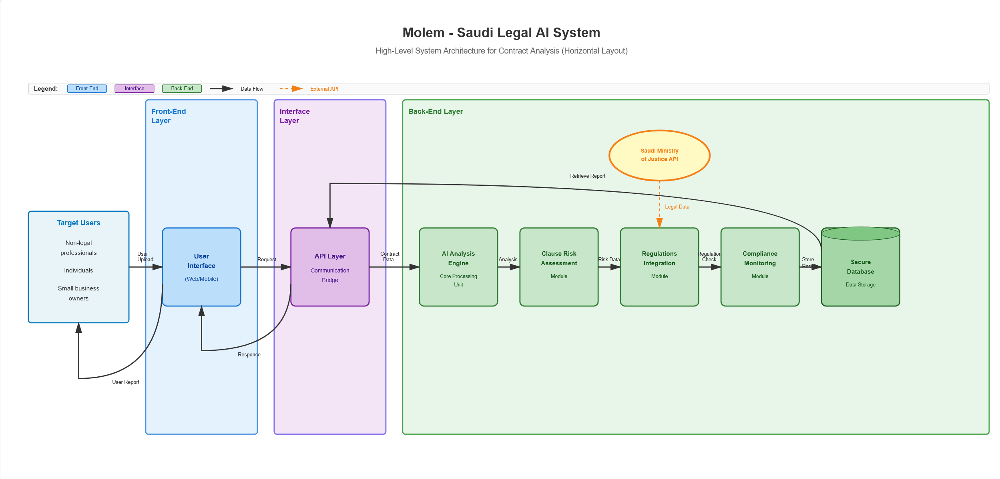
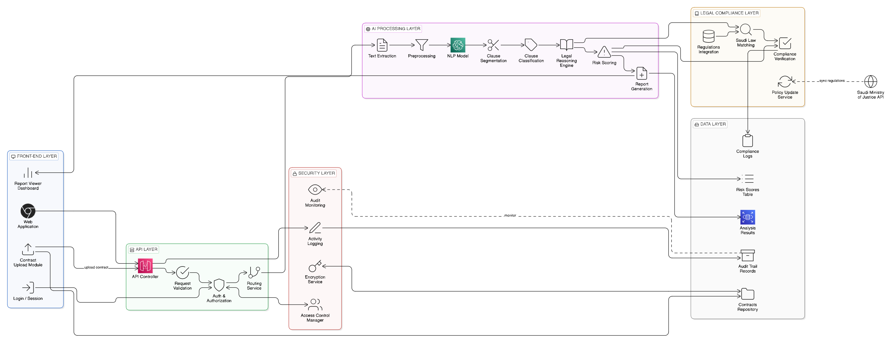
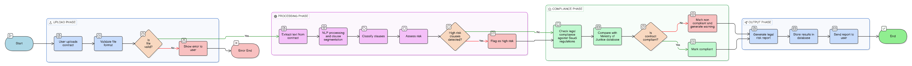
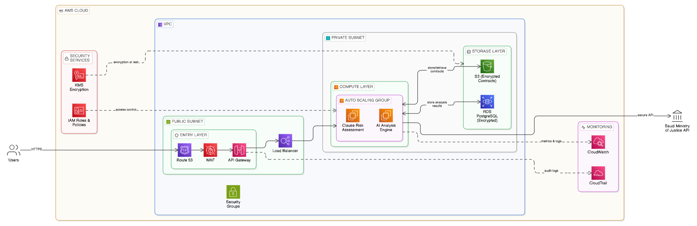

<div align="center">

# Molem — مُلِم
### AI-Powered Saudi Labor Law Contract Analyzer

> A full-stack intelligent legal assistant that analyzes employment contracts against Saudi Labor Law and its Executive Regulations, built as a course project for **Software Engineering Fundamentals**.

[](https://legal-contract-advisor--sfas21.replit.app)
[](#demo)

</div>

---

## Overview

**Molem (مُلِم)** is a web application that helps employees and employers in Saudi Arabia understand their legal rights and obligations under the Saudi Labor Law. Users can upload employment contracts (PDF, DOCX, DOC, TXT) or paste contract text, and the system performs a two-pass AI analysis citing specific law articles. A legal Q&A chatbot is also available for direct questions.

---

## Features

| Feature | Description |
|---|---|
| **Contract Upload & Analysis** | Upload PDF, DOCX, DOC, or TXT contracts for full AI-powered legal analysis |
| **Two-Pass RAG Analysis** | Gemini 2.5 Flash selects relevant law articles, then generates structured analysis |
| **Legal Q&A Chat** | Ask any Saudi labor law question and get cited answers from 524 law articles |
| **Risk Alerts** | Detects unfair or illegal clauses with severity levels (low / medium / high) |
| **Rights Breakdown** | Clearly lists employee and employer rights found in the contract |
| **Law Article Citations** | Every AI response is grounded in specific articles from official sources |
| **Clarifying Questions** | AI asks for missing context before answering (e.g., contract type, nationality) |
| **Arabic RTL UI** | Fully right-to-left interface using Cairo font |
| **JWT Authentication** | Secure registration/login with bcrypt-hashed passwords |

---

## Tech Stack

### Frontend
- **Next.js 15** (App Router) + **TypeScript**
- **Tailwind CSS v4** + **shadcn/ui** components
- **Cairo** Arabic font
- Relative API URLs — no CORS issues

### Backend
- **Express 5** + **TypeScript**
- **Drizzle ORM** + **PostgreSQL**
- **Zod** (validation) + **OpenAPI** spec with Orval codegen
- **JWT** authentication + **bcryptjs**
- **Multer** (file uploads, 10 MB limit)
- **pdf-parse** + **mammoth** (PDF/DOCX text extraction)
- **express-rate-limit** (abuse protection)

### AI & Data
- **Google Gemini 2.5 Flash** via Replit AI Integration
- **524 law articles** seeded from Saudi Labor Law (227) and Executive Regulations (297)
- Two-pass RAG: article selection → structured JSON answer

### Infrastructure (Demo)
- **Replit** monorepo (pnpm workspaces)
- Shared reverse proxy: `/` → Next.js, `/api` → Express
- Deployed on **Replit Autoscale**

---

## Deployment Strategy

> **Demo vs. Production:** The live demo runs on **Replit** — a single-server setup chosen for simplicity and ease of evaluation during the course. The AWS architecture below is the **full production plan**, designed for scalability, high availability, and compliance with Saudi data residency requirements.

| | Demo (Current) | Production Plan (AWS) |
|---|---|---|
| **Platform** | Replit (single server) | AWS Cloud (VPC, multi-AZ) |
| **Entry Point** | Replit proxy | Route 53 → CloudFront → WAF → API Gateway |
| **Compute** | Single process | EC2 Auto Scaling Group (ALB) |
| **Database** | Replit PostgreSQL | RDS PostgreSQL (encrypted at rest) |
| **File Storage** | Server filesystem | S3 (server-side encryption) |
| **Secrets / Keys** | Replit Secrets | AWS KMS + IAM Roles & Policies |
| **Monitoring** | Workflow logs | CloudWatch metrics + CloudTrail audit logs |
| **External API** | Gemini via Replit | Saudi Ministry of Justice API + Gemini |

---

## System Flow

The diagram below shows the core processing pipeline (R1–R9):

```
                        ┌─────────────────┐
                        │  User Uploads   │
                        │  Contract (R1)  │
                        └────────┬────────┘
                                 │
                    ┌────────────▼────────────┐
                    │   Is file valid?        │
                    │  (format + size check)  │
                    └─────┬──────────┬────────┘
                          │ No       │ Yes
                    ┌─────▼──┐  ┌───▼────────────────┐
                    │ Display│  │ Extract & parse     │
                    │ Error  │  │ text (R2)           │
                    └────────┘  │ PDF / DOCX / TXT    │
                                └───────────┬─────────┘
                                            │
                                ┌───────────▼─────────┐
                                │  Analyze Clauses    │
                                │  via Gemini AI (R3) │
                                └───────────┬─────────┘
                                            │
                          ┌─────────────────┴──────────────────┐
                          │                                    │
               ┌──────────▼──────────┐            ┌───────────▼──────────┐
               │  Highlight Risk     │            │  Detect & Flag Risk  │
               │  Clauses (R4)       │            │  w/ Severity (R6)    │
               └──────────┬──────────┘            └───────────┬──────────┘
                          │                                    │
                          └─────────────────┬──────────────────┘
                                            │
                                ┌───────────▼──────────┐
                                │  Generate Summary    │
                                │  in Plain Arabic (R7)│
                                └───────────┬──────────┘
                                            │
                                ┌───────────▼──────────┐
                                │  Display Analysis    │
                                │  & Summary (R9)      │
                                └───────────┬──────────┘
                                            │
                               ┌────────────▼────────────┐
                               │    Need AI Chat?        │
                               └──────┬──────────┬───────┘
                                      │ Yes       │ No
                           ┌──────────▼───┐    ┌──▼──────┐
                           │ Process AI   │    │  Done   │
                           │ Chat (R5)    │    └─────────┘
                           └──────────────┘
```

> **Note on deployment:** The system was designed with a cloud-native architecture in mind. For the course demo, the full application is hosted on **Replit** (frontend + backend on a single domain via reverse proxy), which simplifies setup without affecting functionality.

---

## Use Cases

### UC-1: Upload Contract File

| Field | Details |
|---|---|
| **Actor** | User |
| **Difficulty** | Easy |
| **Pre-condition** | User must be logged into the Molem application |
| **Post-condition** | File is successfully stored and ready for text extraction |

**Flow:**
1. User navigates to the Upload section and selects a PDF, DOCX, DOC, or TXT file
2. System validates the file format and size (max 10 MB)
3. System extracts and stores the raw text in the database
4. System confirms successful upload and shows the contract in the dashboard

---

### UC-2: Generate Simplified Summary

| Field | Details |
|---|---|
| **Actor** | User |
| **Difficulty** | Hard |
| **Pre-condition** | System must have successfully extracted the contract text |
| **Post-condition** | A plain-language summary is presented to the user |

**Flow:**
1. System sends the extracted contract text to the AI engine (Gemini 2.5 Flash)
2. AI identifies and classifies legal terms and clause types
3. AI translates complex legal jargon into plain language
4. Structured summary is displayed on the contract detail page with rights, alerts, and law citations

---

```
┌─────────────────────────────────────────────┐
│              Browser (Next.js)              │
│  /          → Chat interface                │
│  /dashboard → Contract list                 │
│  /contracts/new → Upload or paste           │
│  /contracts/:id → Analysis tabs             │
└────────────────────┬────────────────────────┘
                     │ relative /api/* requests
┌────────────────────▼────────────────────────┐
│           Express API Server                │
│                                             │
│  POST /api/contracts/upload                 │
│  POST /api/contracts/:id/analyze  ←──────┐  │
│  POST /api/chat/messages                  │  │
│                                           │  │
│  ┌─────────────────────────────────────┐  │  │
│  │         Two-Pass RAG Flow           │  │  │
│  │  1. Send article index to Gemini    │  │  │
│  │     → get relevant article IDs      │  │  │
│  │  2. Fetch full article texts        │  │  │
│  │  3. Send contract + articles        │  │  │
│  │     → get structured JSON analysis  │  │  │
│  └─────────────────────────────────────┘  │  │
└────────────────────┬──────────────────────┘  │
                     │                          │
┌────────────────────▼────────────────────────┐
│              PostgreSQL Database            │
│  users, contracts, contract_analyses        │
│  law_articles (524 rows), chat tables       │
└─────────────────────────────────────────────┘
```

---

## AWS Production Architecture

> The diagrams below describe the **planned production deployment** on AWS. The current demo runs on Replit as a simplified single-server setup.

### High-Level System Architecture

Shows the full system from target users through the frontend, API bridge, and all backend processing modules, including integration with the Saudi Ministry of Justice API for regulation data.



**Key layers:**
- **Front-End Layer** — Web/Mobile UI for non-legal professionals, individuals, and small business owners
- **Interface Layer** — API Layer acting as communication bridge between frontend and backend
- **Back-End Layer** — AI Analysis Engine → Clause Risk Assessment → Regulations Integration → Compliance Monitoring → Secure Database
- **External API** — Saudi Ministry of Justice API (legal data retrieval)

---

### Detailed Component Architecture

Breaks down every internal service across the frontend, API, security, AI processing, legal compliance, and data layers.



**AI Processing Pipeline:**
Text Extraction → Preprocessing → NLP Model → Clause Segmentation → Clause Classification → Legal Reasoning Engine → Risk Scoring → Report Generation

**Security Layer:**
Audit Monitoring · Activity Logging · Encryption Service · Access Control Manager

**Legal Compliance Layer:**
Regulations Integration → Saudi Law Matching → Compliance Verification → Policy Update Service

---

### Processing Workflow

End-to-end workflow across four phases: Upload → Processing → Compliance → Output.



| Phase | Steps |
|---|---|
| **Upload** | User uploads contract → validate file format → extract text |
| **Processing** | NLP segmentation → classify clauses → assess risk → flag high-risk items |
| **Compliance** | Compare against Saudi Labor Law articles → check compliance → generate warning |
| **Output** | Compile risk report → send report to user |

---

### AWS Cloud Infrastructure

Full AWS deployment with VPC isolation, WAF, auto-scaling compute, encrypted storage, and audit logging.



**AWS Services used:**
| Service | Role |
|---|---|
| **Route 53** | DNS routing |
| **WAF** | Web Application Firewall — blocks malicious traffic |
| **API Gateway** | Managed API entry point |
| **Load Balancer** | Distributes traffic across EC2 instances |
| **EC2 Auto Scaling** | Clause Risk Assessment + AI Analysis Engine |
| **S3 (Encrypted)** | Contract file storage |
| **RDS PostgreSQL (Encrypted)** | Primary database |
| **KMS** | Encryption key management |
| **IAM Roles & Policies** | Access control |
| **CloudWatch** | Metrics & logs monitoring |
| **CloudTrail** | Audit logs for all API calls |

---

## API Endpoints

| Method | Endpoint | Auth | Description |
|---|---|---|---|
| `GET` | `/api/healthz` | No | Health check |
| `POST` | `/api/auth/register` | No | Register new user |
| `POST` | `/api/auth/login` | No | Login & get JWT |
| `GET` | `/api/auth/me` | Yes | Get current user |
| `GET` | `/api/contracts` | Yes | List user contracts |
| `POST` | `/api/contracts` | Yes | Create from text |
| `POST` | `/api/contracts/upload` | Yes | Upload PDF/DOCX/TXT |
| `GET` | `/api/contracts/:id` | Yes | Get contract + analysis |
| `DELETE` | `/api/contracts/:id` | Yes | Delete contract |
| `POST` | `/api/contracts/:id/analyze` | Yes | Trigger AI analysis |
| `GET` | `/api/law/articles` | No | Search law articles |
| `POST` | `/api/chat/messages` | Yes | Send chat message |
| `GET` | `/api/chat/conversations` | Yes | List conversations |
| `GET` | `/api/chat/conversations/:id` | Yes | Get conversation history |
| `DELETE` | `/api/chat/conversations/:id` | Yes | Delete conversation |

---

## Database Schema

```
users              → id, email, name, password_hash, created_at
contracts          → id, user_id, title, content, file_name, file_size, created_at
contract_analyses  → id, contract_id, status, summary, contract_type,
                     employee_rights, employer_rights, alerts, citations
law_articles       → id, source, article_number, chapter_title,
                     content, summary, order_index
chat_conversations → id, user_id, title, created_at
chat_messages      → id, conversation_id, role, content, citations, created_at
```

---

## Security Measures

- **JWT** with 30-day expiry, signed with `SESSION_SECRET`
- **bcrypt** password hashing (cost factor 10)
- **Rate limiting** on all public endpoints (register: 5/hr, login: 8/15min per account)
- **Per-user upload concurrency guard** (max 2 concurrent uploads)
- **Ownership checks** on all contract/chat operations
- **Bounded payloads** (10 MB file size, 12 MB JSON body)
- **Input validation** with Zod on all API inputs

---

## Project Structure

```
/
├── artifacts/
│   ├── landing/          # Next.js 15 frontend (port 18150)
│   │   ├── app/          # App Router pages
│   │   ├── components/   # UI components (shadcn/ui)
│   │   └── lib/          # API client, auth context
│   └── api-server/       # Express 5 backend (port 8080)
│       └── src/
│           ├── routes/   # auth, contracts, chat, law
│           └── lib/      # analyze, chat, pdf, auth, rateLimits
├── lib/
│   ├── db/               # Drizzle schema + migrations
│   └── api-spec/         # OpenAPI spec + Orval codegen
└── scripts/              # Seed scripts (Saudi Labor Law articles)
```

---

## Demo

> A demo video of the application has been submitted separately to the course instructor, showcasing the full contract analysis flow and legal chat features.

**Live application:** [https://legal-contract-advisor--sfas21.replit.app](https://legal-contract-advisor--sfas21.replit.app)

---

## Law Data Sources

- **Saudi Labor Law** — 227 articles
- **Executive Regulations of the Saudi Labor Law** — 297 articles
- Total: **524 articles** seeded into the database with chapter titles and AI-generated summaries for efficient retrieval

---

<div align="center">
  Built with ❤️ for the Software Engineering Fundamentals course
</div>
